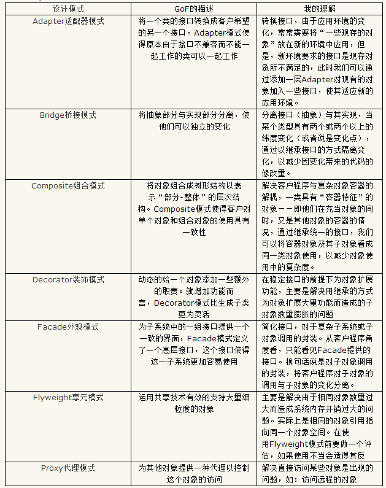

 
#设计模式---结构型模式

设计模式按照目的划分，可以分为三种 创建型、结构型、行为型

1.其中创建型模式与对象的创建有关，

###2.结构型模式处理类或对象的组合；

3.行为型模式对类或对象怎样交互和怎样分配职责进行描述。

结构型设计模式是从程序的结构上解决模块之间的耦合问题，GoF23种设计模式中结构型设计模式有7种，分别是：Adapter适配器模式、Bridge桥接模式、Composite组合模式、Decorator装饰模式、Facade外观模式、Flyweight享元模式和Proxy代理模式。下面分别总结一下这几种模式：

来至网络：

http://shenzhenchufa.blog.51cto.com/730213/242986

[Decorator设计模式.mht](Decorator.mht)

http://www.360doc.com/content/12/0511/17/9249789_210368841.shtml

[相关结构设计模式之间的区别](StructureDifferent.mht)

[代码](Structure.7z)

