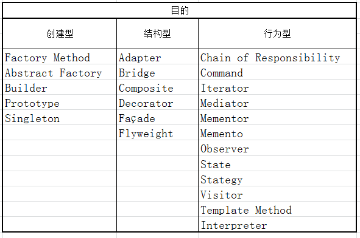
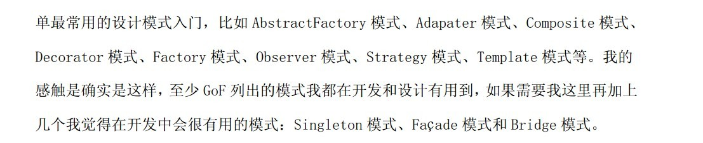
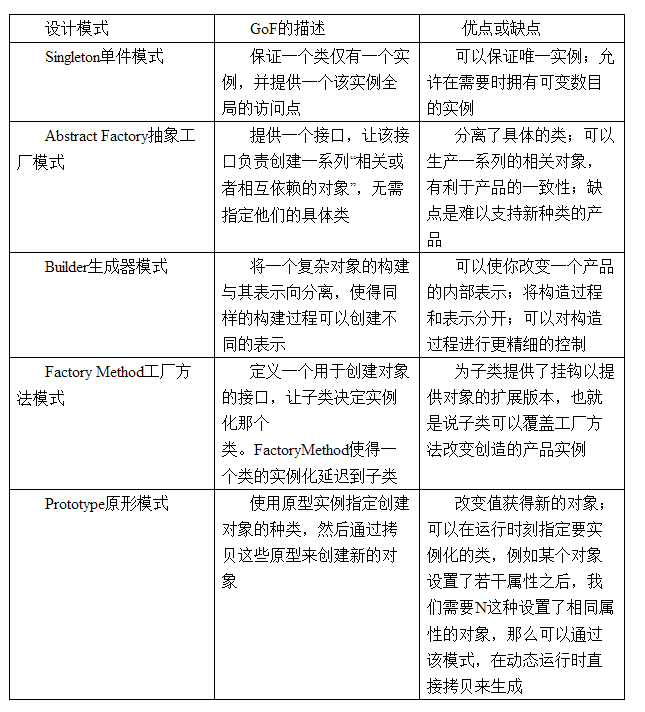

# C++面向对象--23种设计模式

## [示例代码下载](Create.7z)

首先来了解一些基本的东西，有助于理解设计模式。

 在面向对象编程中，理解对象、接口、类和继承子类的概念对大多数人来说并不困难，问题关键在于如何运用它们写出灵活的、可复用的软件，而设计模式则可以告诉你如何去做。

面向对象系统中功能复用最常用的技术是类继承和对象组合。

### 针对复用技术，我们需要遵守两条原则： ###

第一，针对接口编程，而不是针对实现编程；

第二，优先使用对象组合，而不是类继承。

##### 1.针对接口编程有两个好处： #####

第一个好处是客户不需要知道他们使用的对象的特定类型 ，只须对象有客户所期望的接口；

第二个好处是客户无须知道他们使用的对象是用什么类来实现的，他们只须知道定义的接口或者抽象类。
这将极大的减少子系统实现之间的相互依赖关系。

##### 2.优先使用对象组合的优点是：#####

第一，由于对象的实现是基于接口编写的，所以在实现上存在较少的依赖关系，可以在运行时刻动态的替换引用的对象实现；

第二，优先使用对象组合有助于保持每个类背封装，并被集中在单个任务上，这样类和类的继承层次会保持在较少的规模，并且不太可能增长为不可控制的庞然大物；

第三，使用对象组合可以最大限度的不用创建新的构件，而使用已有的构件就可以组装获得所需要的功能。

#### 设计模式就是采用了大量的对象复合技术。设计模式按照目的划分，可以分为创建型、结构型、行为型三种 ##

1.其中创建型模式与对象的创建有关，

2.结构型模式处理类或对象的组合；

3.行为型模式对类或对象怎样交互和怎样分配职责进行描述。

下面是各种模式按照目的划分的分类

创建型模式：Factory Method、Abstract Factory、Builder、Prototype、Singleton

构造型模式：Adapter、Bridge、Composite、Decorator、Façade、Flyweight、
Proxy

行为型模式：Chain of Responsibility、Command、Iterator、Mediator、Mementor、Memento、Observer、State、Stategy、Visitor、Template Method、
Interpreter
  

其中常用的模式有：
   

## 创建型模式之间的区别 ##

由于创建型模式与对象创建有关，所以这几种模式一般不会与其他的结构型模式和行为型模式混淆，这里将创建型模式单独列出来集中讲解。下面分别总结这几种设计模式。
   

这里容易混淆的是Abstract Factory模式和Builder模式，Factory Method模式和Prototype模式也不好区分。Singleton模式没什么太大的困难。下面就来分析一下前四种模式。

一、Abstract Factory模式和Builder模式：

Abstract Factory是应对一系列对象的创建的问题，对于创建一个汽车对象来说，Abstract Factory模式更关注一系列的对象的创建，如：Wheel、Engine、Body等等类型的创建, 这里的一系列可以这样理解，宝马汽车需要宝马的Wheel，宝马的Engine，宝马的Body等等一系列配套的东西，而保时捷汽车则需要保时捷的Wheel，保时捷的Engine等等和保时捷配套的东西。大家注意这换句话说关注点在这一系列对象上，同时它关注创建对象得到的结果。

Builder则是将复杂对象的构建过程与它的表示相分离，使得不同的表示可以使用同样的构建过程。这里我们要注意红色的部分，即构建过程与表示相分离，我们可以如此理解，也就是说将结果与对象创建过程进行分离，这里关注点是过程。Builder模式注重的对象生产的过程，也就是如何一步一步将需要的对象构建起来的，同样对于一个汽车对象来举例，我们需要首先创建Wheel，再创建Engine,再创建Body，然后将他们进行组装，得到想要的汽车对象，可以看到，Builder模式将构建的组装的过程进行了隐藏和封装。而Abstract Factory则只是一系列对象的工厂，组装可能还是需要客户自己来完成。

二、Factory Method模式和Prototype模式：

这两个模式区别比较简单，可以这样理解，Factory Method模式是重新创建一个对象；Prototype模式是利用现有的对象进行克隆，当两个对象或多个对象雷同的时候，可以考虑用一个已创建的对象去克隆出其余的对象。
Abstract Factory一般是利用Factory Method模式来完成一系列对象中的单个对象的创建。
