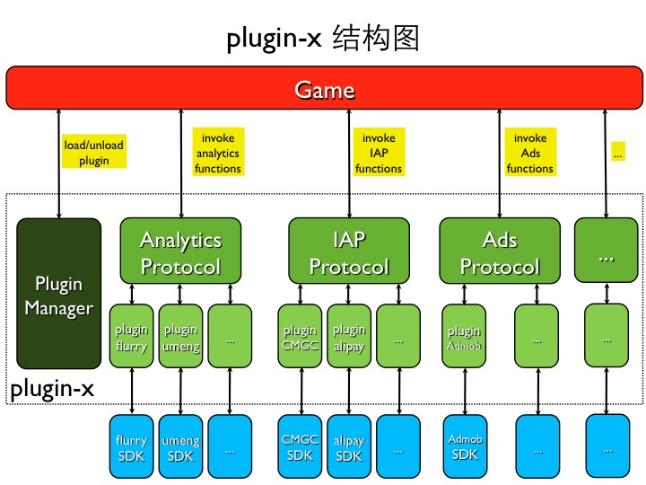

# Plugin-x 结构与实现
## 目录

* [Plugin-x 简介](#ach1)
* [Plugin-x 的结构](#ach2)
* [Plugin-x 的实现](#ach3)
	* [反射机制](#ach3.1)
	* [插件加载流程的改动](#ach3.2)
* [插件的使用演示](#ach4)

## Plugin-x 简介
Plugin-x 是为了方便游戏开发使用各种第三方 SDK 的一个 C++ 框架。在这个框架下面，可以很方便的将第三方 SDK 封装为一个插件(plugin)；而游戏开发者，也可以很方便的使用各种功能的插件(plugin)。

Plugin-x 主要完成的工作就是为各种第三方 SDK 功能封装出 C++ 接口，这样在游戏逻辑代码中就可以直接调用插件提供的扩展功能了。

## Plugin-x 的结构
Plugin-x 的结构需要满足以下几个需求：

* 方便游戏开发者：
	* 对于有类似功能的插件，游戏开发者可以方便切换插件。
	* 对于某些插件 SDK 提供的一些附加功能接口，游戏开发者也可以方便的调用。
* 方便插件开发者
	* 能够方便的封装 SDK 的附加功能接口。
	* 开发插件时尽量减少 C++ 代码。

## Plugin-x 的实现
实际上在 Plugin-x 重构前，已经能够满足前面提到的大部分需求。但是在之前的框架下面，每个插件都必须要编写 C++ 代码，同时，还要完成 C++ 代码与 Java/OC 代码之间的交互。

所以这次进行重构的目标就是让每个插件都不用再编写 C++ 代码。这样能带来两个好处：

* 插件开发者不需要编写 C++ 代码以及与 Java/OC 代码的交互代码。
* 游戏开发者使用插件时，不需要链接插件的 C++ 代码库。

为了把插件中的 C++ 代码摆脱掉，同时游戏又可以调用插件自定义的接口，就需要在 Plugin-x 的框架中实现简单的反射机制。

### 反射机制
Plugin-x 中使用到的只是简单的反射功能：通过函数名调用函数。

1. C++ 层接口设计：
	* 参数  
	  接口设计为可变参数，并新增类型 PluginParam 对一些简单的参数类型进行封装。
	* 返回值  
	  由于实际的返回值是从 Java/OC 中返回的，所以目前只支持了一些基本类型的返回值（std::string, int, bool, float, void）
  
	<pre><code class="c">
	void callFuncWithParam(const char* funcName, PluginParam* param, ...);
	std::string callStringFuncWithParam(const char* funcName, PluginParam* param, ...);
	int callIntFuncWithParam(const char* funcName, PluginParam* param, ...);
	bool callBoolFuncWithParam(const char* funcName, PluginParam* param, ...);
	float callFloatFuncWithParam(const char* funcName, PluginParam* param, ...);
	</code></pre>

2. 插件自定义接口的限制：
	* 对于2个以及2个以上参数的接口，在实现时，接收到的会是一个映射类型的参数。接口实际需要的参数通过 key 来获取，key 的值为 Param1，Param2…ParamN。
	* 因为 OC 中的反射机制传递的参数只能为 id 类型，所以在 ios 上插件自定义接口的参数必须为 id 类型。

	<pre><code>
	\- (void) setGender: (NSNumber\*) gender;
	\- (void) setUserId: (NSString\*) userId;
	\- (void) logTimedEventBeginWithParams: (NSMutableDictionary\*) params;
	</code></pre>

### 插件加载流程的改动
在重构前的框架下，每个插件通过 static 变量最早初始化的特性实现了插件的自动注册功能。

而删除掉插件的 C++ 代码之后，自动注册的功能没法继续使用。插件的加载流程也有相应的改动：约定插件名称与实际的类名相同。

## 插件的使用演示