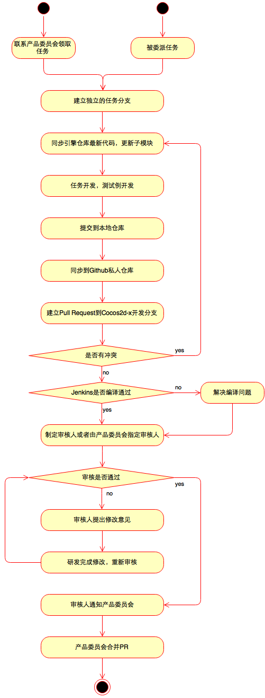

# 引擎贡献指南

## Issues和Pull Requests

Issue：包含bug和任务，会有Labels标记类型、相关模块、相关平台等信息，Mileston标记版本，Assignee标记任务执行人。

Pull Request：代码合并请求，用来解决一个Issue的完整代码实现，由任务执行人或者外部开发者提交，经过审核后代码会被合并到主仓库。

## 版本计划

1. 每个版本之前都有需求整理期，这个阶段会整理出核心版本计划，核心版本计划来源于：

    - 长期路线图（Trello ?）
    - 积累的用户需求（Issues & Pull Requests）
    - 团队成员提出的需求（需要通过审核和讨论）
    - 快速响应市场所得出的需求（产品委员会）

    需求不可以是一句话需求，必须包含完整的需求描述和相关信息，Bug包含重现方法，Feature包含具体需要实现的功能点，最终效果，应用场景等。

2. 整理出的需求由产品委员会确认并制定版本计划，产品委员会暂定包含：

    - 王哲
    - 林顺
    - 侯颍涛
    - 宋媛静
    - 凌华彬
    - 屈光辉

    除此之外，引擎组核心团队任何成员都有权利和责任对需求和版本计划提出自己的不同意见。

3. 定下的版本计划包含几个部分：

    - 新功能，分为Hightlight和非Highlight
    - 功能完善
    - Bug，分为Critical和非Critical
    - 测试例
    - 文档
    - 审核用户PR

4. 同步Redmine
	
    版本计划确定后，产品委员会会指派任务給引擎团队成员。被指派人需要将任务同步到[Redmine系统](http://punchbox.info:3000/projects/cocos2d-x/issues)中，并同步下列信息：

    - 类别
    - 问题描述
    - Github链接，和必要的信息（自行判断）
    - 优先级
    - 目标版本
    - 开始时间和结束时间（为了避免过于平凡的更改和工期互相影响，粗略得以周为单位，开始时间为某一周的周一，结束时间为某一周的周五，代表这个任务需要x周）

    **IMPORTANT** 除了"非Critical的bug"和"审核用户PR"以外的所有任务都需要同步。

    任务信息的同步必须在版本计划确定之后一周内完成，以便PMO制作版本计划报表和时间预估，部分情况下，PMO有可能有需要各位在更短的时间内同步任务信息，也请理解和支持。

5. 需求变更

    版本计划一旦定下，需要遵守下列规则：

    - Hightlight需求原则上不允许移除或延后。
    - Critical Bug原则上不允许移除或延后，如果版本过程中遇到Critical Bug，产品委员会必须审核并决定是否新增到版本中。
    - 原则上不允许增加新功能和功能完善需求。
    - Bug的增删需求可以提出給产品委员会。
    - 版本过程中，用户新增的PR，分为当前版本审核和下一版本审核，可以新增，新增到当前版本审核合并的PR可能有以下特性：
        + 重要性高，解决关键问题或提升体验
        + 简单明了得解决确定的问题
        + 符合当前版本的版本目标

## 领取和完成一个任务

领取和完成一个具体任务的流程如下：

1. 自主领取或被分配任务
    
    自主领取的任务需要提交給产品委员会列入版本计划并分配，当Github任务中的Assignee字段变为你之后，这个任务就是你的了。

2. 从主要的工作分支建立出独立的任务分支

3. 在任务分支上完成任务

    完成任务包含以下几项指标：

    - 完成任务代码
    - 代码符合规范
    - 完成测试例（已有测试例则不需要）
    - 编译没有warning
    - 验证所有平台可运行，测试例没有问题
    - 完成相关文档（新功能使用文档，API文档等）

4. 提交代码到自己Fork的Cocos2d-x仓库或其子仓库

5. 建立Pull Request到Cocos2d-x仓库的主开发分支（e.g. v3）

6. 需要编译的PR保证Jenkins编译通过

7. 自行指定审核人（reviewer）或者告知产品委员会指定审核人

    鼓励自行指定审核人，可以直接在PR中@ 对方，被@ 的人，必须尽快给出回应，同意审核或建议他人审核。

8. 审核阶段
    
    审核人给出意见，PR贡献者解答对方疑问或者修改代码，这个阶段的响应要求很快。合格的审核要满足以下要求：

    - **IMPORTANT** 理解PR目标，检查API设计是否合理
    - 理解贡献者的代码框架和逻辑
    - 测试是否可以正常运行，某些平台相关的PR需要检查平台兼容性
    - 检查是否有包含不相关的commit或修改
    - 检查代码是否符合规范

9. 审核通过通知产品委员会，由产品委员会合并PR

10. 由产品委员会关闭相关任务

11. 开发标记Redmine系统上的任务为已解决，转发給产品委员会

需要注意的事项：

1. 任务分支上不可以包含其他任务或者不相关的commit
2. 保证commit历史的简单干净（活用rebase和squash），用英文清晰得描述每个commit
3. 原则上每个commit都应该能够编译
4. 不需要编译的PR必须在建立PR的时候在title上添加[ci skip]前缀
5. 当审核人觉得PR比较重要需要更多人审核的时候提需求給产品委员会
6. 原则上要求PR都有对应的Issue，并被纳入计划，除非是简单明了的修改，某些允许没有Issue，但此时PR必须被收录进某个版本。对于有Issue和PR的任务，PR不会被收录到Milestone中，只有Issue会收录。

## 任务点数系统

从v3.8开始，会尝试使用任务点数系统，每个任务会被分配点数，用来预估任务难度和花费时间，下面是暂定的点数系统规则：

1. 由于每个开发人员的效率不同，1点相当于组内top研发的一个小时，比如以张小明为基准，如果小明需要一个小时的任务计为1点，那么1点的任务对于其他研发人员可能相当于2个小时，4个小时或更长时间
2. 点数取值为2的幂：1, 2, 4, 8, 16, 32...
3. 只在Redmine上体现，Github上没有
4. 在Redmine上通过`预期时间`字段来表示
5. 任务的点数由产品委员会来审核并设置
6. 如果点数无法估计说明任务拆分有问题，需要重新考量
7. 每个版本会统计团队成员的点数贡献，并逐步估计出每个人在每个版本可能达到的点数贡献量，并未后续版本的计划安排提供参考

## Labels

所有任务都用标签直观得标记它的信息：

- `type:xxx` 用来标记任务类型，包含bug, doc, feature, refine, request
- `module:xxx` 用来标记相关模块
- `platform:xxx` 用来标记相关平台
- `api:xxx` 用来标记API修改，包含added, removed, changed
- `script:xxx` 用来标记相关脚本语言，包含lua或jsb
- `highlight` 用来标记关键任务
- `critical` 用来标记重大bug
- `test case` 用来标记测试例任务
- `tech support` 用来标记需要技术支持回复的问题

## Milestones

除了当前版本和下个版本Milestone外，还有以下长期存在的Milestones

- unconfirmed：未确认的bug或需求，需要由技术支持或研发人员确认
- unplanned：已确认的bug和需求，暂时未列入版本计划，相当于未来版本的需求池
- next：下一个版本的任务
